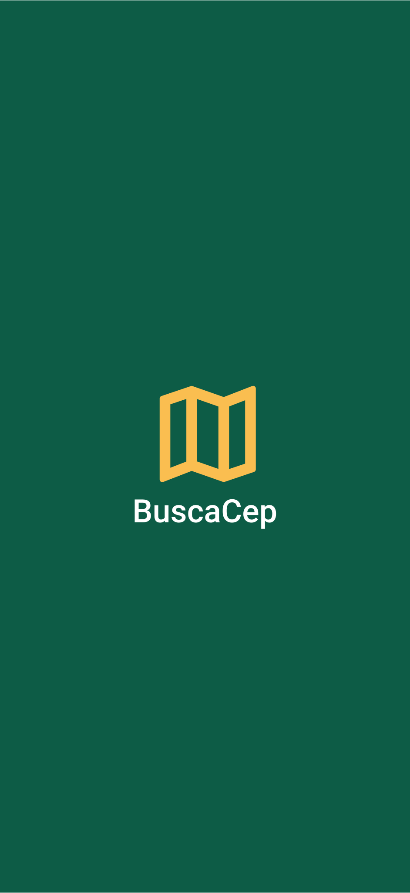

<h1 align="center">
    
</h1>

<p align="center">
     <br>
     
</p>

**BuscaCep** é uma projeto pessoal criado com react native e typescript utilizando a API do ViaCep para buscar todas as informações do cep e retornar em tela.

# Propósito do Projeto

BuscaCep pode te ajudar se você trabalha com entregas e quer ter informações da localização de seus compradores apenas com o cep.

## 🚀 Instalando o projeto na sua maquina

Para instalar o projeto, siga estas etapas:

Linux e macOS:

```bash
$ git clone https://github.com/alextfonseca/BuscaCep.git
$ cd buscaCep
$ yarn ou npm
$ expo start
```

Windows:

```bash
$ git clone https://github.com/alextfonseca/BuscaCep.git
$ cd buscaCep
$ yarn ou npm
$ expo start
```

# Tecnologias

Tecnologias utilizadas no desenvolvimento do projeto:

- [React Native](https://reactnative.dev/)
- [TypeScript](https://www.typescriptlang.org/)
- [Expo](https://expo.io/)
- [Api ViaCep](https://viacep.com.br)

# 🧑‍💻 Criador

<table>
  <tr>
    <td align="center">
      <a href="https://github.com/alextfonseca">
        <br>
        <sub>
          <b>Alex Teixeira da Fonseca</b>
        </sub>
      </a>
    </td>
  </tr>
</table>
